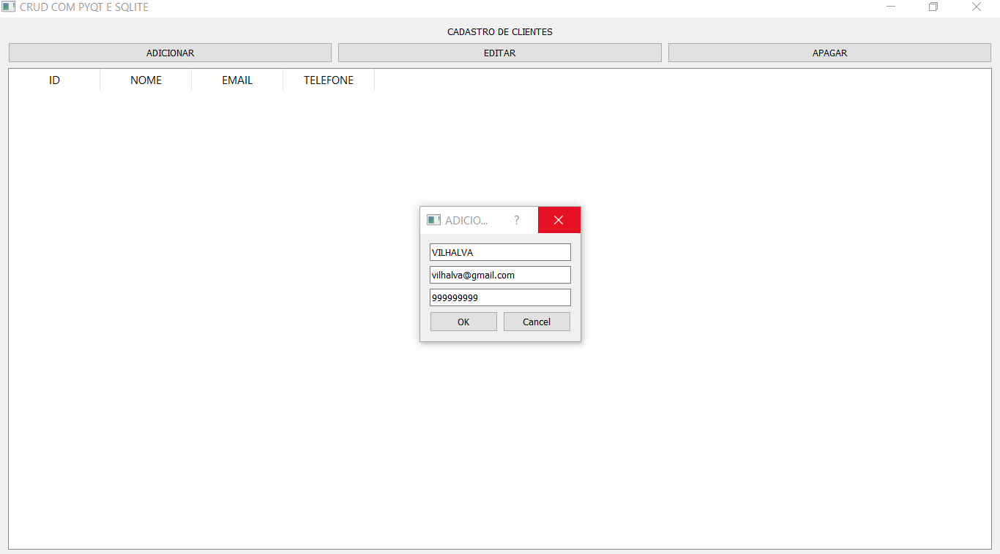
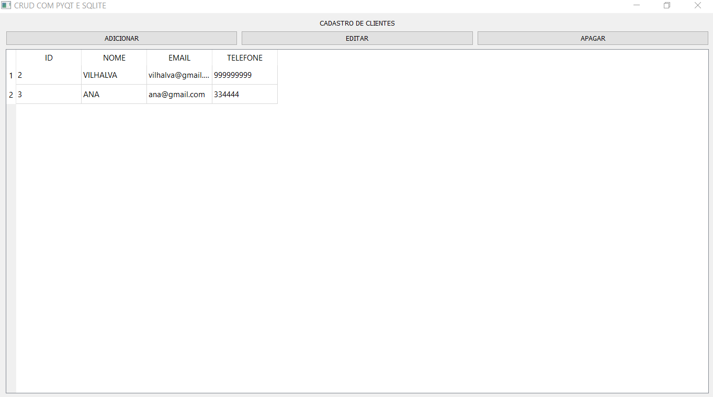
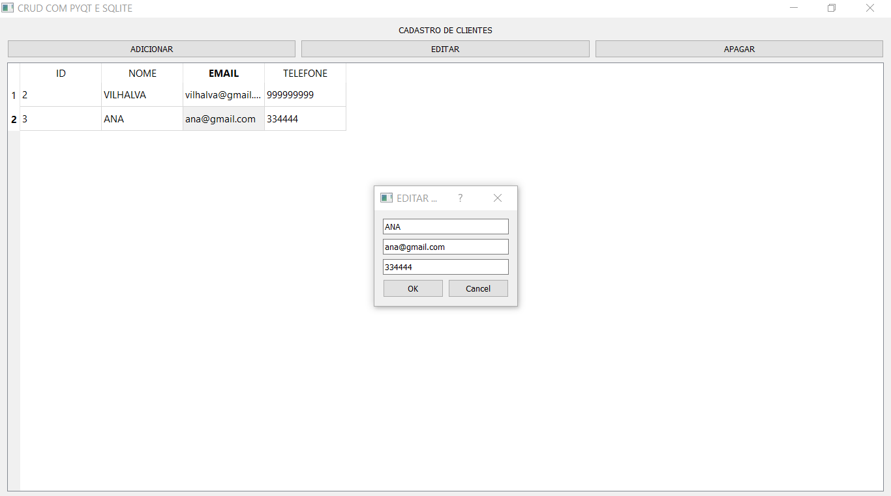
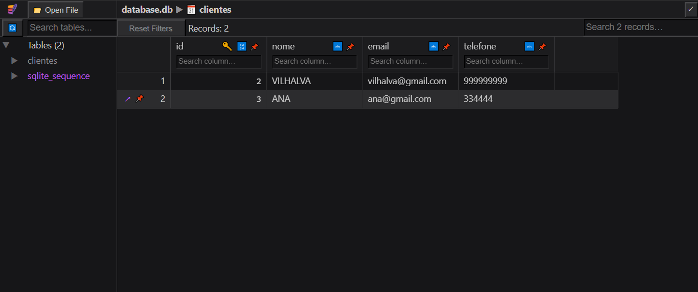

# CADASTRO DE CLIENTES COM PYQT
👨‍🏫CRUD DE CADASTRO DE NOME, EMAIL E TELEFONE COM PYQT E SQLITE.

 <br>
 <br>
 <br>
 <br>
 <br>

## DESCRIÇÃO:
Esse projeto é uma aplicação de CRUD (Create, Read, Update, Delete) utilizando PyQt5 para a interface gráfica e SQLite como banco de dados. Vamos analisar as funcionalidades:

1. **Interface Gráfica Principal (`JanelaPrincipal`)**:
   - **Configuração**: Define uma janela principal (`QMainWindow`) com um título, dimensões e uma conexão SQLite (`database.db`).
   - **Widgets**: Utiliza layouts (`QVBoxLayout`, `QHBoxLayout`) para organizar os elementos na interface.
   - **Botões**: Inclui botões para adicionar, editar e deletar registros.
   - **Tabela de Dados**: Utiliza `QTableWidget` para exibir os registros do banco de dados em forma tabular.
   - **Métodos**:
     - `setup_ui()`: Configura a interface gráfica inicial.
     - `criar_tabela()`: Cria a tabela `clientes` no banco de dados SQLite se não existir.
     - `carregar_dados()`: Carrega os dados da tabela `clientes` para exibir na `QTableWidget`.
     - `abrir_janela_adicionar()`: Abre uma janela de diálogo para adicionar um novo cliente.
     - `inserir_registro()`: Insere um novo registro na tabela `clientes`.
     - `editar_registro()`: Permite editar um registro existente ao selecionar um item na tabela.
     - `atualizar_registro()`: Atualiza um registro na tabela `clientes`.
     - `deletar_registro()`: Deleta um registro ao confirmar a exclusão por meio de uma caixa de diálogo.
     - `closeEvent()`: Fecha a conexão com o banco de dados ao fechar a aplicação.

2. **Janelas de Diálogo (`DialogoAdicionar` e `DialogoEditar`)**:
   - **`DialogoAdicionar`**: Janela modal para adicionar um novo cliente. Inclui campos para nome, email e telefone.
   - **`DialogoEditar`**: Derivado de `DialogoAdicionar`, permite editar os campos de um cliente existente ao inicializar com dados preenchidos.

3. **Execução da Aplicação**:
   - Inicia a aplicação PyQt com `QApplication`.
   - Cria uma instância de `JanelaPrincipal` e a exibe com `janela.show()`.
   - Utiliza `sys.exit(app.exec_())` para iniciar o loop de eventos do PyQt.

## EXECUTANDO O PROJETO: 
1. **Instalação:**
   Certifique-se de ter PyQt5 e SQLite instalados:

   ```bash
   pip install PyQt5
   ```

2. **Iniciando o APP:**
   - Entre no diretório `CODIGO` e execute com o comando:
   ```bash
   python CODIGO.py
   ```

3. **Interagindo com APP:**
   - **Adicionar**: Clique no botão "Adicionar", preencha os campos na janela de diálogo e clique em "Ok".
   - **Editar**: Selecione um registro na tabela e clique no botão "Editar". Faça as alterações na janela de diálogo que abrirá e clique em "Ok".
   - **Deletar**: Selecione um registro na tabela e clique no botão "Deletar". Confirme a exclusão na caixa de diálogo que aparecerá.
   - **Fechar Aplicação**: Ao fechar a aplicação, os dados serão salvos no banco de dados SQLite (`database.db`).

## NÃO SABE?
- Entendemos que para manipular arquivos em muitas linguagens e tecnologias, é necessário possuir conhecimento nessas áreas. Para auxiliar nesse aprendizado, oferecemos cursos gratuitos disponíveis:
* [CURSO DE PYTHON](https://github.com/VILHALVA/CURSO-DE-PYTHON)
* [CURSO DE PYQT](https://github.com/VILHALVA/CURSO-DE-PYQT)
* [CURSO DE SQLITE](https://github.com/VILHALVA/CURSO-DE-SQLITE)
* [CONFIRA MAIS CURSOS](https://github.com/VILHALVA?tab=repositories&q=+topic:CURSO)

## CREDITOS:
- [PROJETO CRIADO PELO VILHALVA](https://github.com/VILHALVA)


